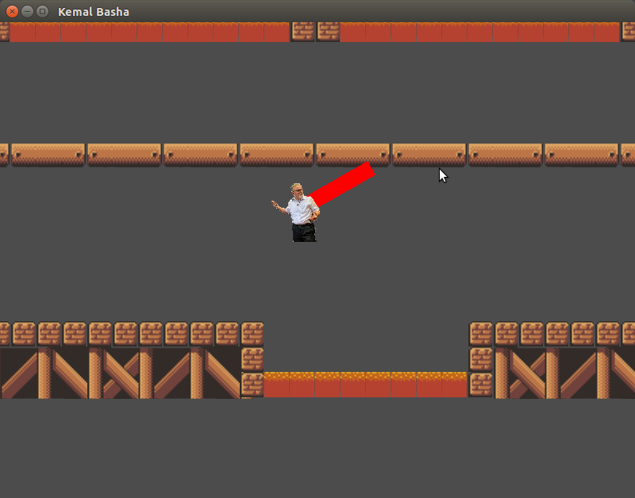
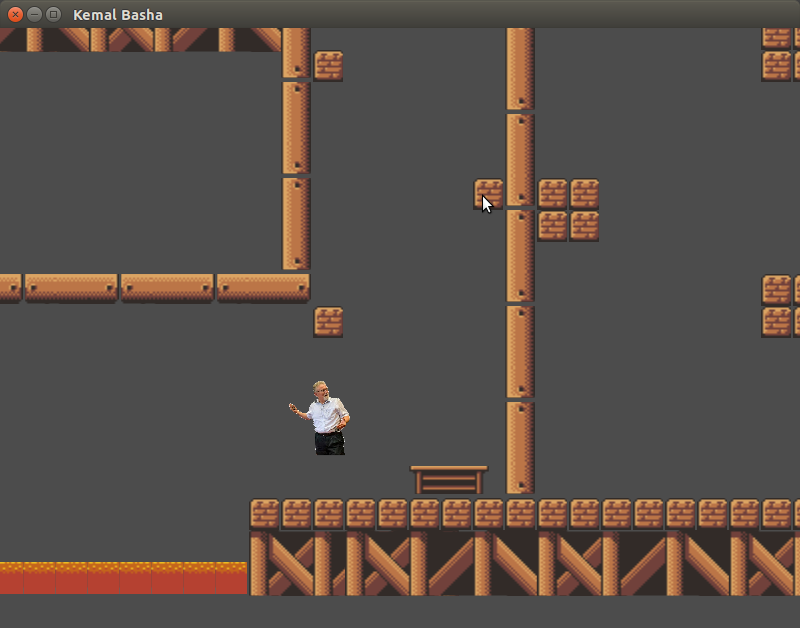
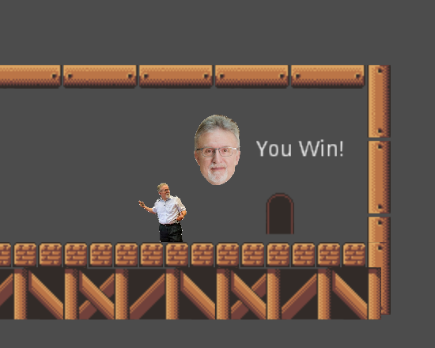

# Kemal Basha

Made for the 2019 CMU-Q Game Jam with the help of https://github.com/AboudFayad.

## Running

Install [Godot](https://godotengine.org/).

Then:

```
godot -e project.godot
```

This opens up Godot, from there, click on the play button.

## Screenshots







## Disclaimer

*This game is a work of fiction. Names, characters, places and incidents either are products of the author’s imagination or are used fictitiously. Any resemblance to actual events or locales or persons (especially any sort of a Professor specializing in Natural Language Processing), living or dead, is entirely coincidental.*

